# Fixing Opus 5: System Prompt Engineering

> **One system prompt turns Opus 5 from a verbose smartass into a precise senior engineering partner.**
> For mid to senior engineers running frontier coding agents (Claude Code, Pi, or any harness with an appendable system prompt).

📺 Watch this video to get the full breakdown of this codebase: **[Fixing Opus 5 on YouTube](https://youtu.be/S_QdQ1G4GlU)**

<p align="center">
  
</p>

Opus 5 is one of the smartest models ever shipped and one of the most exhausting to work with. It buries answers under six headers, burns more output tokens than any model before it, and stamps Anthropic's co-author credit on commits you paid for. This repo fixes that with a single file, `sr_opus_5_system_prompt.md`, appended to every session. **The model is not broken. The communication channel is, and the system prompt is where you fix it.**

---

## Install

### Agentic Install

```bash
just install        # runs the /install slash command in Claude Code (or Pi, or your favorite agentic coding tool)
```

The `/install` command lives at `.claude/commands/install.md`. It verifies `just`, `claude`, `herdr`, `jq`, and `pi`, auto-installs what it can, and confirms the compare loop is ready.

### Manual Install

**Prereqs:** [`just`](https://github.com/casey/just), [`claude`](https://docs.claude.com/cli). For the side-by-side comparison: [`herdr`](https://herdr.dev) and `jq`. For the Pi mirror recipes: [`pi`](https://github.com/mariozechner/pi-coding-agent).

```bash
git clone <REPO_URL> && cd sr-opus-5   # get the code
brew install just herdr jq              # toolchain
npm install -g @mariozechner/pi         # optional: the Pi coding agent
just                                    # list recipes
just sr-opus                            # boot Opus 5 with the system prompt appended
```

That is the entire setup. The system prompt is plain markdown passed via `--append-system-prompt-file`. No build, no dependencies, no config.

---

## Why this exists

<p align="center">
  
</p>

You know the tics. `load-bearing`. `worth stating plainly`. `You're absolutely right!`. Em dash after em dash. `## KEY TAKEAWAYS` with **bold** on every line, wrapped around a one-sentence answer. Every one of those tokens is money out of your pocket and time spent scanning for the actual answer.

Most engineers respond by tuning individual user prompts, over and over, one task at a time. That is the low-leverage move. **Prompt engineering is not dead. It moved into the system prompt, where every word you write is multiplied across every prompt you send.**

---

## The two prompt inputs

<p align="center">
  
</p>

You control two inputs to your agent. Most engineers only use one.

| Input | Role | Scope |
|---|---|---|
| User prompt | The work order | One task |
| **System prompt** | **The operating contract** | **Every task, every turn** |

The user prompt says what to do. The system prompt says how to operate, and it is present on every single turn of every single session. If you want a behavior applied globally (concise responses, no sycophancy, no co-author credits), the system prompt is the only place that scales.

---

## What's inside the system prompt

<p align="center">
  
</p>

[`sr_opus_5_system_prompt.md`](sr_opus_5_system_prompt.md) is one document with a purpose statement, four instruction sections, and a set of concrete examples.

| Section | What it does |
|---|---|
| Purpose | Sets the relationship: no-bs, clear, concise, actionable. Explains why. |
| 1. Positive and Negative Patterns | Do-this and never-do-this behavior lists. The banned-phrase list lives here. |
| 2. Reference Points | Short codes for findings, decisions, options, risks, questions, actions. |
| 3. Hard Operational Boundaries | Scope control. No unrequested cleanup, no co-authors, no completion claims without evidence. |
| 4. Aliases | Two-to-three letter commands that expand into full instructions. |
| Examples | Real do and do-not response pairs, distilled from actual model outputs. |

### 1. Positive and negative patterns

<p align="center">
  
</p>

Two explicit lists: replicate these behaviors, avoid these words and patterns. This is where the banned phrases live (`load-bearing`, `worth stating plainly`, flattery, em dash chains) next to the habits you want reinforced on every response.

### 2. Reference points

<p align="center">
  
</p>

The agent labels its output with codes: `F1` for findings, `D1` for decisions, `O1` for options, `R1` for risks, `Q1` for questions, `A1` for actions. Your follow-ups collapse into near-zero-token commands:

```
keep D1, reject O2, answer Q1
```

No re-quoting, no re-explaining. You and the agent share an index into the conversation.

### 3. Hard operational boundaries

<p align="center">
  
</p>

Scope control for a model trained to do as much as possible. The requested task passes through. Unasked refactors, adjacent cleanup, completion claims without evidence, and co-author credits in your commits do not.

### 4. Aliases

<p align="center">
  
</p>

| Alias | Expansion |
|---|---|
| `scr` | Simplify, compress, and repeat your response. |
| `eli` | Explain this like I'm 18. Simplify. Shorten. |
| `foc` | Focus on what matters most. Boil it down to the one thing. |
| `ref` | Rewrite your response with reference points. |

Aliases are bash aliases for conversation. They can also point at your skills and commands.

### Examples (in-context distillation)

The examples section is training data you author. Take a response you liked (from any model), tighten it, paste it as a `To do`. Take a bloated response, paste it as a `Not to do`. The model pattern-matches examples harder than rules, so this is where the tone actually locks in.

---

## The compare loop

Every change to the system prompt gets verified side by side against the stock model on the same task: summarizing a long blog post ([`ai_docs/zuck-thefutureisforeveryone.md`](ai_docs/zuck-thefutureisforeveryone.md)).

```
just                    # list all recipes
just install            # agentic setup via /install
just sr-opus            # Opus 5 + the system prompt (the fix)
just smart-ass-opus     # Opus 5 stock (the control)
just compare <name>     # herdr workspace: both side by side, same prompt fired into each

just sr-pi              # the same fix in the Pi coding agent
just smart-ass-pi       # stock Opus 5 in Pi
just pi-compare <name>  # the same side-by-side loop in Pi
```

`just compare <name>` opens a herdr workspace with two Claude Code panes: `smart-ass-opus-5` on the left, `sr-opus-5` on the right. Same model, same prompt, one variable: the appended system prompt. Watch response length, output tokens, and wall-clock time diverge in real time. Then iterate: edit the system prompt, `just compare <next-name>`, observe the delta.

The `pi-*` recipes run the identical experiment in the [Pi coding agent](https://github.com/mariozechner/pi-coding-agent) via `--append-system-prompt`. Same file, different harness: proof the system prompt is portable across agents.

---

## Folder structure

```
sr-opus-5/
├── README.md                            # this file
├── LICENSE                              # MIT
├── justfile                             # launch + compare recipes
├── sr_opus_5_system_prompt.md           # the system prompt — the entire product
├── ai_docs/
│   └── zuck-thefutureisforeveryone.md   # long blog post used as the comparison benchmark
├── images/                              # animated SVG diagrams (numbered for narrative order)
└── .claude/
    └── commands/
        └── install.md                   # /install — toolchain verification
```

---

## Make it your own

These sections are a starting place, not a finished product. They are a few dedicated system prompt ideas for improving a great but flawed language model so it communicates the way that works best for engineers. Extend them: add your own positive and negative patterns as you catch new tics, grow the banned-phrase list, invent reference codes for your domain, wire aliases to your own skills and commands, and keep distilling responses you like into the examples section. **The framework transfers to whatever model ships next. Only the word list changes.**

---

## Where it can still fail

- **Non-determinism.** These are probabilistic systems. A banned phrase or stray em dash still slips through occasionally. When one does, add it to the negative patterns list and move on.
- **Append, not replace.** `--append-system-prompt-file` layers on top of Claude Code's own system prompt. You are steering the harness, not replacing it, so harness-level behaviors persist.
- **Model drift.** New model, new tics. The verbal tic list is Opus 5 specific and will need re-tuning per model. The structure (patterns, references, boundaries, aliases, examples) does not change.
- **Over-compression.** Aggressive conciseness can drop context you actually wanted. That is what the aliases are for: `scr` to compress further, or just ask for more detail when the task warrants it.

---

## License

MIT — see [`LICENSE`](LICENSE).

---

## Master Agentic Coding

Prepare for the future of software engineering (Phase 3 is coming).

Don't fall behind, master Agentic Coding patterns with [Tactical Agentic Coding](https://agenticengineer.com/tactical-agentic-coding?y=srop5).

Follow the [IndyDevDan YouTube channel](https://www.youtube.com/@indydevdan) to improve your agentic coding advantage.

---

Stay Focused and Keep Building

- IndyDevDan
